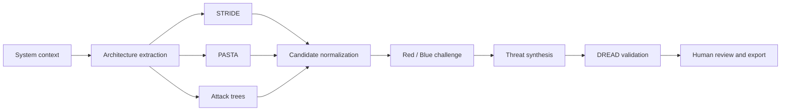

<p align="center">
  <picture>
    <source media="(prefers-color-scheme: dark)" srcset="public/brand/argus-wordmark-white.svg">
    <source media="(prefers-color-scheme: light)" srcset="public/brand/argus-wordmark.svg">
    
  </picture>
</p>

<h1 align="center">Argus</h1>

<p align="center">
  Local-first agentic threat modeling for architecture reviews, evidence-backed findings, and human security decisions.
</p>

<p align="center">
  <strong>STRIDE</strong> · <strong>PASTA</strong> · <strong>Attack Trees</strong> · <strong>Red / Blue Review</strong> · <strong>DREAD</strong>
</p>

> [!IMPORTANT]
> Argus is a local proof of concept. It generates a reviewable threat-model draft; it does not prove vulnerabilities, replace security testing, or certify a system.

## Why I built it

The idea started while I was reading a finance paper that used debate between agents to examine stock-investment decisions. I kept thinking about the debate itself: what if threat-modeling agents had to challenge one another's assumptions before presenting their conclusions to a security reviewer? What began as a small experiment grew through many rounds of building and reviewing.

I built the [earlier Agentic Threat Modeler](https://github.com/philocyber/agent-threat-modeler) in Python, with LangGraph orchestration, a FastAPI interface, local models, and Red / Blue debate. Argus is a substantial reworking of that idea and the review experience. It adds a dedicated web workspace, project and run history, source traceability, explicit reviewer decisions, and a clearer way to see what the analysis can and cannot support. The aim is to make threat modeling easier to inspect and improve, not to treat an agent debate as proof that a finding is true.

I want this to be a useful community project. Try it on systems you are authorized to assess, challenge the findings, report where the evidence is weak, and tell me what would make the workflow better. Issues, corrections, ideas, and contributions are welcome; see [Contributing](CONTRIBUTING.md).

## What it does

Argus turns a system description, RFC, or architecture document into a traceable threat model. It extracts the system architecture, runs complementary analysis methods, challenges candidate threats through bounded Red / Blue debate, synthesizes the results, and applies DREAD scoring before human review.

The current product includes:

- Per-project local workspaces with SQLite, uploads, run artifacts, and review state.
- STRIDE, PASTA-inspired, and attack-tree analysis with architecture traceability.
- Red / Blue challenge, synthesis, DREAD scoring, and explicit partial-run handling.
- Human confirmation, rejection, notes, comments, reruns, diffs, and archival.
- Optional RAG over user-approved technical and organizational sources, with retrieval provenance.
- Ollama, Google Gemini, Kimi, AWS Bedrock, and Cursor inference providers.
- PDF, CSV, Markdown, and JSON exports.
- A separate pipeline worker, durable checkpoints, live progress, cancellation, and run telemetry.

## Analysis flow



Each run uses one authorized LLM provider. Retries and quality gates do not silently route the same run to another vendor.

## Quick start

The recommended local installation uses [Docker Desktop](https://docs.docker.com/desktop/) with Linux containers. You do not need to install Node.js, pnpm, or Ollama separately. On first launch, choose an API provider or local Ollama inference. The API path asks for the provider credential and starts without downloading Ollama models; the local path prepares the configured models. Both paths build the app and worker and wait for a health check. Docker images still need download space and internet access on first use.

### Windows

Open Docker Desktop and complete its first-run setup. In **Command Prompt** (`cmd.exe`), run:

```bat
git clone https://github.com/philocyber/argus-tm.git
cd argus-tm
scripts\setup.cmd
```

Or, in **PowerShell**, run:

```powershell
git clone https://github.com/philocyber/argus-tm.git
Set-Location argus-tm
.\scripts\setup.ps1
```

Run these commands from the repository root. In Command Prompt, use the `.cmd` launcher: `./setup.ps1` is PowerShell syntax and does not work in `cmd.exe`. If you are already in the `scripts` directory, run `setup.cmd` instead.

If PowerShell blocks local scripts, use `scripts\setup.cmd` from Command Prompt, or run `powershell.exe -NoProfile -ExecutionPolicy Bypass -File .\scripts\setup.ps1` for this launch. You do not need to change the system-wide execution policy.

### macOS

Install and start [Docker Desktop for Mac](https://docs.docker.com/desktop/setup/install/mac-install/), then open Terminal and run:

```bash
git clone https://github.com/philocyber/argus-tm.git
cd argus-tm
bash scripts/setup.sh
```

You also need Git to clone the repository. If Docker Desktop is missing, the launcher can offer installation through `winget` on Windows or Homebrew on macOS; finish Docker's first-run setup and reopen the terminal if its CLI is not yet available. Docker may require virtualization support or a restart.

Use the smaller local profile on constrained machines:

```bash
# macOS
bash scripts/setup.sh --light

# Windows PowerShell
.\scripts\setup.ps1 -Light

# Windows Command Prompt
scripts\setup.cmd start -Light
```

The standard local-model profile downloads Qwen 3.5 4B, Qwen 3.5 9B, and Qwen3 Embedding 4B: approximately 12.5 GB of model data before Docker images and build layers. Allow more than 30 GB of free disk space; 16 GB RAM is recommended. The light profile uses Qwen 3.5 4B for both analysis tiers and the 0.6B embedding model. It reduces resource use but does not guarantee good analysis quality on every machine. API inference skips these model downloads. Knowledge retrieval defaults off in API mode because embeddings currently require local Ollama; it can be enabled after installing the embedding model.

When the launcher prints `Argus is ready`, open [http://127.0.0.1:8080](http://127.0.0.1:8080) (or the `APP_PORT` configured in `.env.docker`). Create a project, add a **synthetic** system description, start an analysis, then review the generated findings and their evidence. A successful health check confirms that the services started, not that an analysis has completed. Projects, knowledge, vectors, and models persist in named Docker volumes.

To check prerequisites or inspect a failed start, run the command for your shell:

| Action | Windows Command Prompt | Windows PowerShell | macOS Terminal |
| --- | --- | --- | --- |
| Diagnose | `scripts\setup.cmd doctor` | `.\scripts\setup.ps1 doctor` | `bash scripts/setup.sh doctor` |
| Status | `scripts\setup.cmd status` | `.\scripts\setup.ps1 status` | `bash scripts/setup.sh status` |
| Logs | `scripts\setup.cmd logs` | `.\scripts\setup.ps1 logs` | `bash scripts/setup.sh logs` |
| Stop (keep data) | `scripts\setup.cmd stop` | `.\scripts\setup.ps1 stop` | `bash scripts/setup.sh stop` |

The launcher creates `.env.docker` from `.env.docker.example` on first use and stores the chosen provider and any entered credential there. This ignored file contains secrets in API mode: keep it private and never commit or share it. Use `-Provider google` (PowerShell) or `--provider google` (macOS) to choose without the menu; `ollama`, `kimi`, `cursor`, and `bedrock` are also supported. See the [Docker local guide](docs/operations/docker-local.md) for diagnostics, updates, backups, and the macOS CPU-only trade-off.

### Native development

Contributors who want hot reload can install Node.js **22.23.2**, pnpm **11.1.2**, Ollama, and Chroma on the host:

```bash
pnpm install --frozen-lockfile
cp .env.example .env.local       # PowerShell: Copy-Item .env.example .env.local
node scripts/dev.mjs models
pnpm dev
```

`pnpm dev` starts Next.js and `pipeline-worker`. `pnpm dev:next` starts only the UI; analyses remain pending until `pnpm pipeline:worker` is also running.

## Knowledge retrieval

RAG is optional. When enabled, Argus expects a usable Chroma collection and the configured local embedding model.

1. Start the Docker stack, or start Chroma and Ollama for native development.
2. Open **Knowledge** in Argus.
3. Add approved sources under Technical or Corporate.
4. Synchronize the index and review its health before starting a run.

Indexed content is not automatically evidence. Review the selected passages, source version, relevance, and relationship to each finding. See the [RAG architecture](docs/architecture/rag.md) and [knowledge-base contract](knowledge_base/README.md).

## Runtime model

| Surface | Responsibility |
| --- | --- |
| Next.js application | Local UI, API admission, results, reviews, and exports |
| `pipeline-worker` | Claims queued runs and executes the analysis graph |
| SQLite workspace | Primary single-user project state |
| PostgreSQL | Optional shared-service transition path |
| Chroma + Ollama embeddings | Optional retrieval over approved corpora |
| Selected LLM provider | Architecture analysis and threat-model generation |

Without `DATABASE_URL`, each project keeps its database and artifacts in a local workspace. Native runs default to `~/.agentictm/projects`; the Docker setup uses a persistent `workspace_data` volume. Neither is part of the Git repository. If you set `AGENTICTM_WORKSPACE_ROOT`, keep it outside the checkout. PostgreSQL support is available for service deployments but is not the primary delivery mode of this proof of concept.

## Development checks

```bash
pnpm lint
pnpm typecheck
pnpm test
pnpm check:docs
pnpm drizzle:check
pnpm build
```

`pnpm check` combines the main static, test, documentation, and migration checks. Provider-specific scripts (`test:gemini`, `test:kimi`, `test:bedrock`, and `test:cursor`) use real credentials and may incur usage charges.

## Security and data boundaries

- The supported local application is single-operator and has no browser login. Keep it bound to loopback.
- Cloud providers receive the context selected for their run. Provider choice does not establish retention, residency, or contractual approval.
- Inputs, reports, traces, and local workspaces can contain sensitive architecture. Do not commit them.
- `.gitignore` excludes local project directories, project databases, and the contents of `knowledge_base/` while keeping its README. Check `git status` before committing; never use `git add -A` on a checkout that contains unreviewed user data.
- RAG embeddings currently depend on Ollama even when analysis uses a cloud provider.
- A `completed` run means the configured pipeline finished. It does not establish exhaustive document coverage or complete threat discovery.
- Failed, partial, and unscored results remain explicit rather than being presented as a clean assessment.

Read [SECURITY.md](SECURITY.md) before using non-synthetic data or planning a shared deployment.

## Documentation

- [Documentation index](docs/README.md)
- [Local setup](docs/getting-started/local.md)
- [Product and operating model](docs/architecture/product.md)
- [Analysis pipeline](docs/architecture/pipeline.md)
- [Context, coverage, and quality gates](docs/architecture/context-and-coverage.md)
- [RAG architecture and inspector](docs/architecture/rag.md)
- [Troubleshooting](docs/getting-started/troubleshooting.md)
- [Contribution guide](CONTRIBUTING.md)

The running application also provides current operator documentation at `/docs`.

## Project status

Argus is an experimental, **source-available** project under the [PolyForm Perimeter License 1.0.1](LICENSE). Individuals and companies may run and adapt it for their own internal work, including replacing the branding. The license also permits sharing copies and modifications with its required notices. It does not permit providing a competing threat-modeling product or service to others, whether paid or free. This is not an OSI-approved open-source license. Read the [usage summary](PROJECT_STATUS.md) and the license before reuse or redistribution. The [earlier Python repository](https://github.com/philocyber/agent-threat-modeler) remains a separate MIT-licensed release.

Some existing workspace paths, environment variables, browser storage keys, and webhook headers still use the previous technical identifiers. They are retained so existing projects and integrations keep working after the Argus rebrand.
