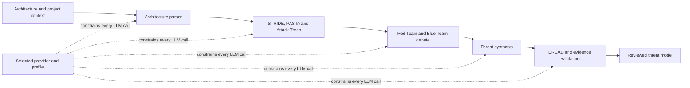
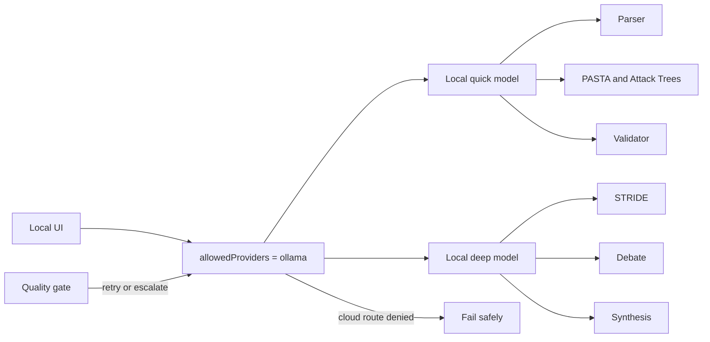
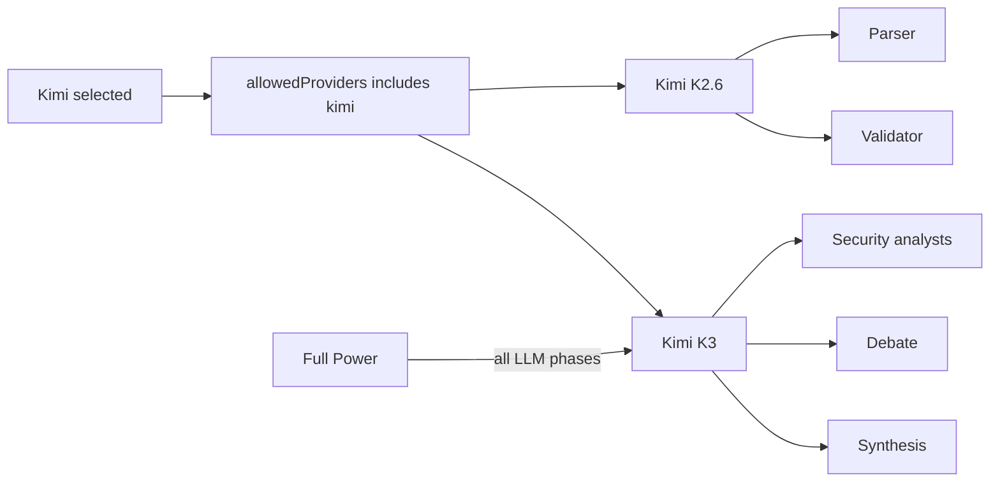
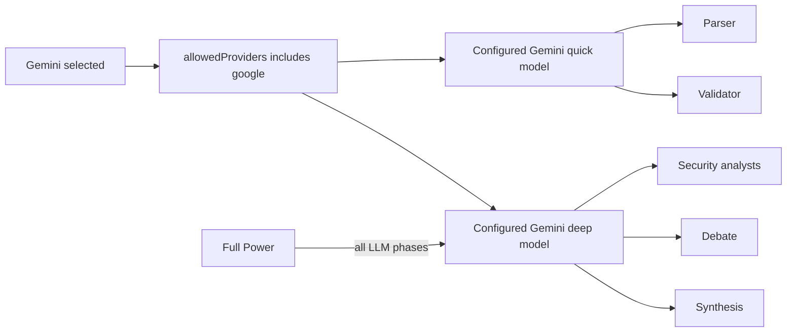
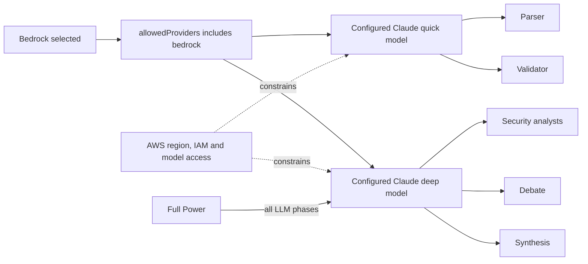
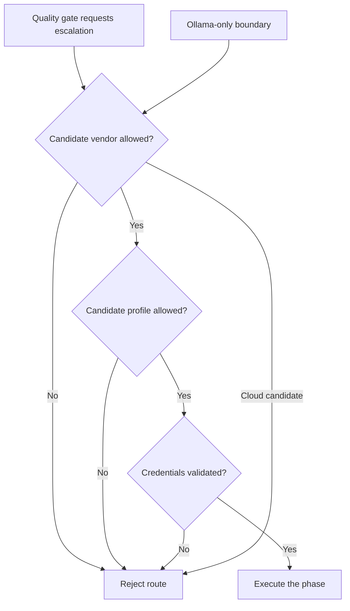

# LLM providers and inference routing

Los nombres de modelos son defaults de
configuración del repositorio, no una garantía de disponibilidad futura en cada
cuenta o región.

Argus separates provider selection from model assignment. Each run uses exactly one provider and one execution profile.

- `provider` is the only vendor authorized for the run.
- `allowedProviders` must contain exactly that provider for API compatibility and auditability.
- `executionProfile` is the only route used by the run.
- `allowedProfiles` must contain exactly that profile.

The central privacy invariant is:

> A phase, retry or future quality gate may never route to a different provider.

If `allowedProviders` is `["ollama"]`, cloud fallback is impossible. A local failure remains local and either retries locally or fails the run.

## Supported providers

| Provider | Value | Integration | Authentication |
|---|---|---|---|
| Ollama | `ollama` | `@langchain/ollama` | None |
| Google Gemini | `google` | `@langchain/google-genai` | `GOOGLE_API_KEY` |
| Kimi / Moonshot | `kimi` | OpenAI-compatible Moonshot API | `MOONSHOT_API_KEY` or `KIMI_API_KEY` |
| AWS Bedrock | `bedrock` | Bedrock Converse API | AWS region and credential chain |
| Cursor (Grok 4.7) | `cursor` | `@cursor/sdk` `Agent.prompt` (text only) | `CURSOR_API_KEY` |

## Execution profiles

| Profile | Starting route | Quality-gate boundary |
|---|---|---|
| `local_efficient` | Ollama quick/deep split | Ollama only |
| `provider_optimized` | Selected cloud vendor quick/deep split | Selected provider only |
| `provider_full_power` | Selected vendor deep model for every LLM phase | Selected provider only |
| `adaptive_value` | Optimized route | Same-provider retry path reserved; automatic rerouting is not enabled yet |

`provider_full_power` does not mean “use any stronger provider.” It means “use the configured deep tier of the selected provider in every LLM phase.”

## Common pipeline



## Provider-specific debate profiles

The shared profile table is `lib/agents/debate-profile.ts`. Provider entries change cost and latency controls, while the same correctness rules remain mandatory: stable draft IDs, independent Red and Blue reasoning, copy detection, a written final close, source-backed adjudication for disputes, and no cross-provider fallback.

- Ollama uses at most eight candidates, batches of three, one active batch, a separate evidence pass, provisional summaries, final judge coverage for every finding, and a second repair check. This is the quality-first local workflow requested for the 9B model.
- Kimi uses batches of five, one active batch, and direct structured reasoning over the source-backed dossier. The judge receives only disputed or dual-rejected findings. A clean agreement closes from Blue's final control analysis after copy and repetition checks, and stays labeled as a team conclusion.
- Cursor uses batches of five, up to three active batches, direct structured reasoning, final judge coverage for every finding, and 4,096 reserved output tokens.
- Other hosted providers inherit conservative batches of three and two-phase evidence until measured results justify an override.

The Cursor v31 baseline spent 62 of 83 model calls in debate, 16.6 minutes, with 1.57 million input and 276,824 output tokens. For the same 11 candidates and two rounds, the v33 geometry has a minimum of 15 core debate calls before repairs, about 76% fewer calls. The Kimi v15 baseline spent 56 of 75 calls in debate and 18 minutes 59 seconds. For 15 candidates, v33 needs 12 core calls when every batch agrees and at most 15 when every batch needs a judge, about 73% to 79% fewer calls. Ollama deliberately does not target fewer calls because its profile prioritizes quality over cost.

Source relevance review is cached by stable candidate batch across debate rounds. A contested-only judge receives only the requested candidates and their side assessments, which avoids resending settled findings.

## Ollama architecture



Recommended local profile:

```env
LLM_PROVIDER=ollama
OLLAMA_QUICK_MODEL=qwen3.5:4b
OLLAMA_DEEP_MODEL=qwen3.5:9b
```

Selecting `provider_full_power` with Ollama maps both roles to `OLLAMA_DEEP_MODEL`. It does not authorize a cloud vendor.

Ollama generative calls are queued one-at-a-time per endpoint. Structured emission uses native `format` JSON Schema. There is no hidden free-text fallback after a structured failure. Changing Ollama models does not change cloud model IDs.

## Kimi architecture



```env
MOONSHOT_API_KEY=sk-...
KIMI_BASE_URL=https://api.moonshot.ai/v1
KIMI_QUICK_MODEL=kimi-k2.6
KIMI_DEEP_MODEL=kimi-k3
```

Kimi API billing is separate from Kimi Membership and Kimi Code subscriptions. The UI saves the API key only to the ignored local `.env.local` file. Structured calls send `response_format: { type: "json_schema", json_schema: { name, schema, strict: true } }` as documented at https://platform.kimi.ai/docs/api/chat. That contract is validated with a simulated transport in this checkout; a live Kimi test is a separate acceptance stage.

Choose the API region that issued the key: global keys use `https://api.moonshot.ai/v1`; China-platform keys use `https://api.moonshot.cn/v1`. The readiness check authenticates with `GET /models`, verifies both configured model IDs, and then runs model-specific smoke calls. K2.6 uses non-thinking mode for deterministic pipeline stages; K3 uses `reasoning_effort` and `max_completion_tokens`.

## Gemini architecture



```env
GOOGLE_API_KEY=...
GEMINI_QUICK_MODEL=gemini-3.5-flash-lite
GEMINI_DEEP_MODEL=gemini-3.1-pro-preview
```

Model lifecycle matters. Stable model IDs should be preferred for repeatable production runs; preview models should be pinned intentionally and covered by the provider smoke check.

## Claude through AWS Bedrock architecture



```env
BEDROCK_AWS_REGION=us-east-1
BEDROCK_AWS_ACCESS_KEY_ID=...
BEDROCK_AWS_SECRET_ACCESS_KEY=...
BEDROCK_QUICK_MODEL=anthropic.claude-haiku-4-5-20251001-v1:0
BEDROCK_DEEP_MODEL=anthropic.claude-sonnet-5
```

Model availability depends on the selected AWS region, account access and IAM policy. Use the UI credential check before starting an analysis.

## Quality-gate routing contract



The server validates the boundary again even if the request came from the local UI. Requests containing multiple providers or profiles are rejected. Cloud credentials must also be configured and validated.

## API examples

Strictly local:

```json
{
  "provider": "ollama",
  "allowedProviders": ["ollama"],
  "executionProfile": "local_efficient",
  "allowedProfiles": ["local_efficient"]
}
```

Kimi end to end, full power:

```json
{
  "provider": "kimi",
  "allowedProviders": ["kimi"],
  "executionProfile": "provider_full_power",
  "allowedProfiles": ["provider_full_power"]
}
```

Kimi optimized:

```json
{
  "provider": "kimi",
  "allowedProviders": ["kimi"],
  "executionProfile": "provider_optimized",
  "allowedProfiles": ["provider_optimized"]
}
```

This run cannot move to Gemini, Bedrock or Ollama. To use Kimi Full Power, select that profile before starting a new run.

## Cursor SDK (Grok 4.7)

Cursor is an agent runtime, not a chat-completions API. Argus wraps `Agent.prompt()` as a LangChain `ChatModel`.

```bash
LLM_PROVIDER=cursor
CURSOR_API_KEY=...
# optional overrides (defaults already grok-4.7 / Fast on quick):
# CURSOR_QUICK_MODEL=grok-4.7
# CURSOR_DEEP_MODEL=grok-4.7
# CURSOR_QUICK_FAST=true
```

Create a key at https://cursor.com/dashboard/integrations (never paste it in the browser). The [Cursor model reference](https://cursor.com/docs/models/grok-4-7) lists `grok-4.7` for the SDK with a 256k standard context window. Constraints (ASI-01): `tools: []`, isolated empty temp `cwd`, `settingSources: []`. Quick uses Fast when the account supports it; set `CURSOR_QUICK_FAST=false` if Fast is unavailable. Existing runs keep their saved model selection. `pnpm test:cursor` smoke-tests the key and makes a live model call.

## Data-retention recommendation

Use cloud inference for sensitive or critical architecture only after approving
the provider's contract, retention, training, residency, subprocessors and log
handling. In the AWS production profile, Bedrock with task-role credentials is
the natural default when its model and region have been approved. Ollama remains
the option when architecture context must stay inside infrastructure controlled
by the organization.

## Credential handling

Provider credentials entered in the local UI are validated server-side and written to `.env.local`, which is ignored by Git. Keys are never returned to the browser. Cloud model IDs remain server-controlled; the local UI may choose Ollama model tags after strict syntax validation.

Credential validity and model readiness are checked separately. A credential that authenticates successfully is saved even if a configured model is unavailable, so the UI can report the exact model or permission problem without asking for the key again. Gemini and Kimi discover the account model catalog before inference; Bedrock distinguishes credential failures from IAM/model-access failures; Ollama verifies that both configured model tags are installed.

Use `POST /api/v1/llm/check` or the UI **Check saved key** action to verify the configured quick and deep tiers before starting a run.
